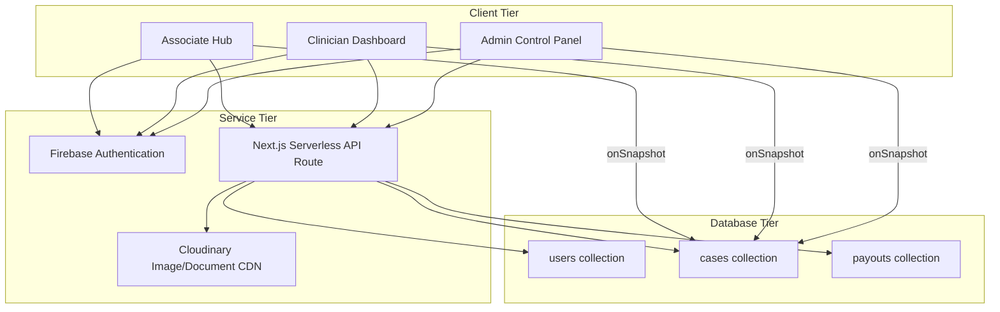
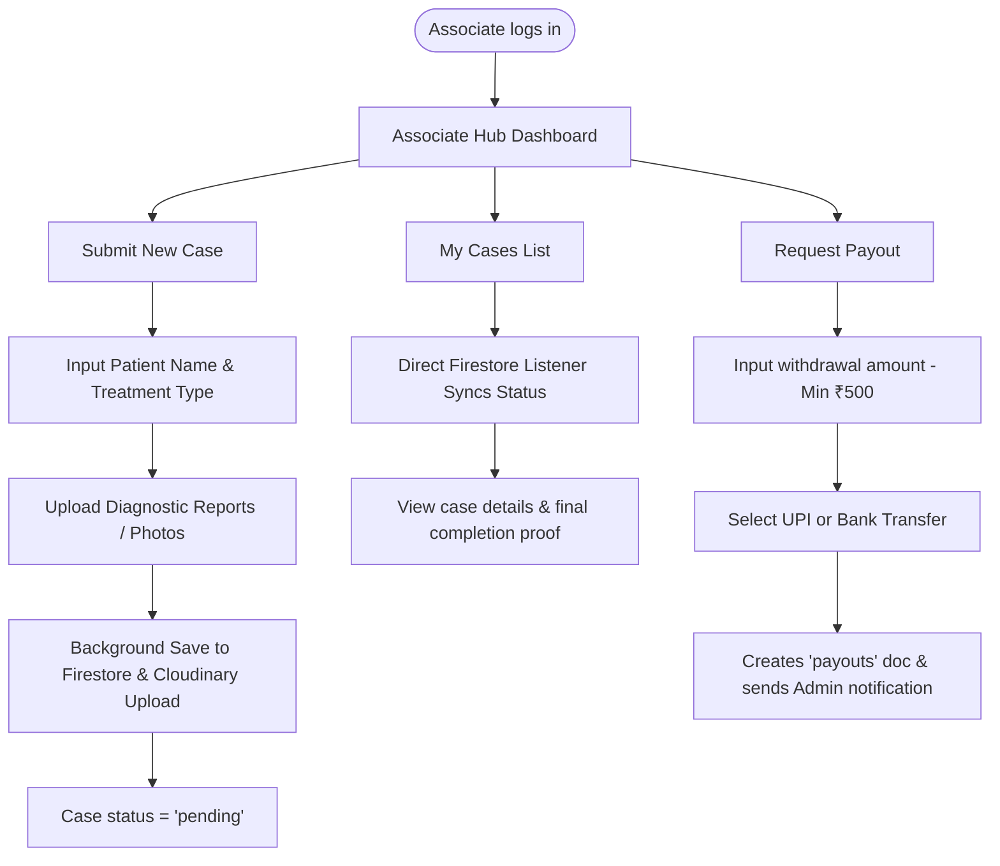
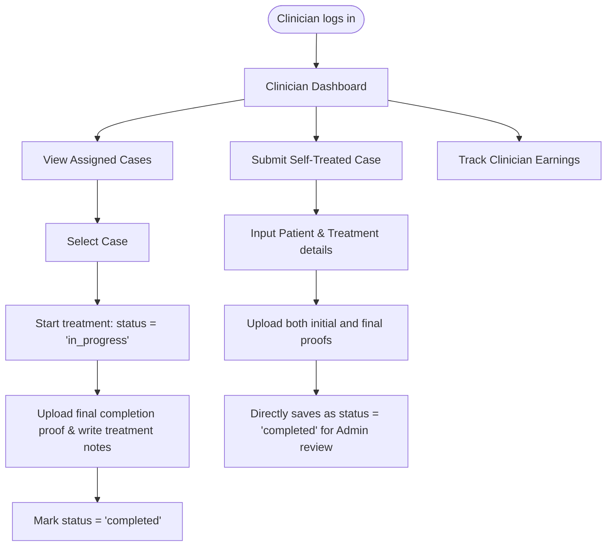
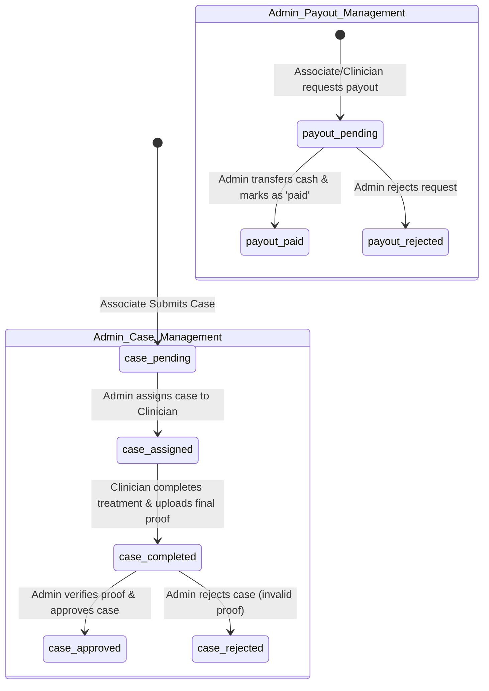

# 🦷 Blueteeth — Enterprise Clinical Rewards Platform


## 📋 Overview
**Blueteeth** is a premium, full-stack clinical case management and rewards platform designed for modern dental practices. It streamlines the workflow between associates, clinicians, and administrators, ensuring secure case evidence handling and automated reward tracking.

### ✨ Key Features
- **Role-Based Dashboards**: Tailored experiences for Admins, Clinicians, and Associates.
- **Secure Evidence Vault**: Authenticated file upload and viewing system for clinical proofs (PDFs/Images).
- **Automated Workflows**: Real-time status tracking from submission to approval.
- **Dynamic Payout System**: Automated points calculation and payout management.
- **Premium UI/UX**: Dark-mode support, smooth animations (Framer Motion), and tactile feedback.

## 🛠️ Technology Stack
- **Frontend**: Next.js 15 (App Router), React, Tailwind CSS
- **Backend**: Firebase (Firestore, Auth, Storage)
- **Animations**: Framer Motion
- **Icons**: Lucide React
- **Date Handling**: Date-fns

## 🚀 Getting Started

First, install the dependencies:
```bash
npm install
```

Then, run the development server:
```bash
npm run dev
```

Open [http://localhost:3000](http://localhost:3000) with your browser to see the result.

## 📁 Project Structure
- `/src/app`: Next.js pages and API routes.
- `/src/components`: Reusable UI components.
- `/src/context`: Authentication and global state management.
- `/src/lib`: Utility functions and Firebase configuration.
- `/src/types`: TypeScript definitions.

---

## 🔄 System Workflows & Roles Spec

This platform operates three primary dashboards: Associate Hub, Clinician Dashboard, and Admin Control Panel.

### 1. High-Level Architecture Flow



### 2. Role-Based Workflow Breakdown

#### 🤝 Associate Hub Workflow
Associates submit diagnostic details and track payout releases.
* **Flow**: Login &rarr; Submit Case (patient details + initial scans) &rarr; Real-time case tracking via Firestore stream &rarr; Request payout (&ge; ₹500).



#### 🩺 Clinician Dashboard Workflow
Clinicians oversee treatment progress, record clinical notes, and upload final procedural proofs.
* **Flow**: View assigned list &rarr; Accept case (status `in_progress`) &rarr; Perform treatment &rarr; Upload completion proofs &rarr; Mark status as `completed`.



#### 👑 Admin Panel & Settlement Workflow
Admins assign clinicians, verify post-op medical files, and approve payout ledger transactions.
* **Flow**: Review case &rarr; Assign to Doctor &rarr; Audit clinician's final proofs &rarr; Approve case (locks status to `approved`, credits points/earnings) &rarr; Settle payouts (atomic database transaction).



### 🔑 Test Accounts & Credentials (Development Mode)
To demo or review the system panels locally, you can use:
* **Admin Role**: `admin@blueteeth.in` (Password: `Admin@12345`)
* **Clinician Role**: `maillonin7687@gmail.com` (Password: `Password@123`)
* **Associate Role**: `agrizenai@gmail.com` (Password: `Password@123`)

---
Built with ❤️ for the Blueteeth Office.
